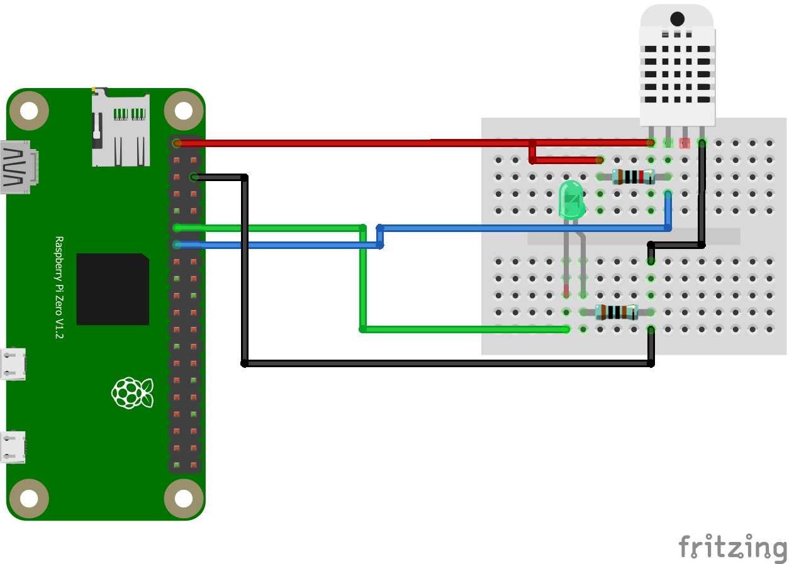

# General
Small iot demonstration using 2 RaspberryPi ZeroW's reading sensor data
and propagating it to microservices - probably using socket.io.
This is a NodeJS project using mainly Cylon.js and other node-plugins (see [package.json](package.json)).

# NodeJS installation guide for rasp0 / armv61:
first check
1. uname -m

for appropriate version. then:

2. wget https://nodejs.org/dist/latest/node-v10.5.0-linux-armv6l.tar.gz (see https://nodejs.org/dist/latest/ for newest)
3. tar -xzf node-v10.5.0-linux-armv6l.tar.gz
4. cd node-v10.5.0-linux-armv6l
5. sudo cp -R * /usr/local/
6. export PATH=$PATH:/usr/local/bin

# install BCM 2835 LIB for DHT22 sensor:
1. wget http://www.airspayce.com/mikem/bcm2835/bcm2835-1.56.tar.gz
2. tar -zxvf bcm2835-1.xx.tar.gz
3. cd bcm2835-1.xx
4. ./configure
5. make
6. sudo make check
7. sudo make install

# How to run this project:
1. git clone https://github.com/lstuckstette/SGSE_IOT_DEMO
2. cd SGSE_IOT_DEMO
3. npm install
4. npm start
5. ?
6. profit